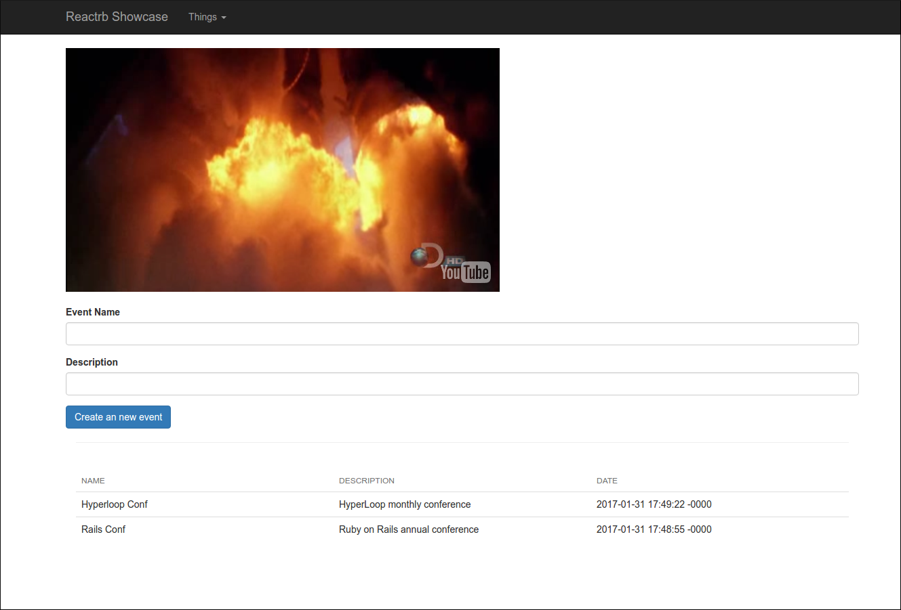

# HyperLoop Showcase

This is a simple Rails application showcasing **HyperReact** (wrapper for the React.js library for creating user interfaces), Opal, NPM, Webpack, React Bootstrap, **HyperMesh** (gives your **HyperReact** components CRUD access to your server side ActiveRecord models and implements push notifications)  and other associated technologies. 

This Showcase application will mix native React and **HyperReact** components, be styled by Bootstrap CSS (using ReactBootstrap), display a video (using a native React component) and use **HyperMesh** to handle data for an Events feed app.

The Showcase application will look like this:



### Technologies highlighted in this Showcase application

+ For the backend we are using [Rails 5.0.1](http://rubyonrails.org/) with [Ruby 2.3.1](https://www.ruby-lang.org/en/news/2016/04/26/ruby-2-3-1-released/)
+ [NPM](https://www.npmjs.com/) and [Webpack](https://webpack.github.io/) to manage front end assets
+ [HypeRails](https://github.com/ruby-hyperloop/hyper-rails) to install [HyperReact](https://github.com/ruby-hyperloop/hyper-react) and Opal in Rails 4.x or 5.x
+ [HyperReact](https://github.com/ruby-hyperloop/hyper-react) to use [React](https://facebook.github.io/react/) with Rails and to write reactive UI components with Ruby's elegance
+ [React Bootstrap](https://react-bootstrap.github.io/) to show how to use native React components in [HyperReact](https://github.com/ruby-hyperloop/hyper-react)
+ [HyperMesh](https://github.com/ruby-hyperloop/hyper-mesh) between Rails models and the front end and to magically push 
  changed data between all connected clients
+ [HyperReact Hot-Reloader and Opal IRB](https://github.com/fkchang/opal-hot-reloader) for programmer joy and hot-loading with developing

## Introduction

### Introductions to **HyperReact**
+ [An overview of HyperReact (formerly Reactrb) by Mitch VanDuyn](http://slides.com/mitchvanduyn/deck-1-3#/)
+ [Power of React-js with the joy of Ruby by Forrest Chang](http://www.slideshare.net/fkchang/reactrb-all-the-power-of-reactjs-with-all-the-joy-of-ruby)

### HyperReact Help and Questions

+ [Gitter.im](https://gitter.im/reactrb/chat) for general questions, discussion, and interactive help.
+ [Stack Overflow](http://stackoverflow.com/questions/tagged/reactrb) tag `reactrb` for specific problems.
+ [Github Issues](https://github.com/ruby-hyperloop/hyper-react/issues) for bugs, feature enhancements, etc.
+ [Further reading](#further-reading) at the end of this tutorial

### Using NPM and Webpack alongside Rails

Ruby libraries are distributed as gems, and are managed in your Rails app using the Gemfile and bundler.

In the Javascript world things are still evolving but I have found that the easiest way to manage Javascript libraries is using NPM (Node Package Manager) and Webpack.  Pretty much every front end library is packaged with NPM these days so it is easy to get help and most things just work.

Happily NPM, Webpack, Rails, and **HyperReact** can all play together very nicely.

+ [NPM](https://www.npmjs.com/)
+ [Webpack](https://www.npmjs.com/package/webpack)

This tutorial requires that Ruby, Rails, NPM and Webpack are installed. Please see their websites for installation instructions.

## Setup

### Step 1: Creating a new Rails application

```
	rails new hyperloop-showcase
	cd hyperloop-showcase
	bundle install
```

Update your Database config file for accessing your Database properly : `config/database.yml`

Then execute 

```
	rails db:create
```

You should have a empty Rails application

```
	bundle exec rails s
```

And in your browser

```
	http://localhost:3000/
```

You should be seeing the Rails Welcome aboard page. Great, Rails is now installed. Lets get started with the interesting stuff.

### Step 2: Adding HyperReact and HyperMesh

There are 2 ways do achieve that :

+ Using **HyperLoop** installation generator
OR
+ Manually.

In this tutorial we advise you to follow the manual way, so you can see what's happen and you can be sure to have all gems versions identical to those used in this tutorial.

if you want to see the automatic way for the future you can go to the official **HyperLoop web page** : [HyperLoop installation with Rails](http://ruby-hyperloop.io/installation/#with-rails)

#### Manual installation of HyperReact and HyperMesh

##### Step 2.1: Add the gems

in your `Gemfile`
```ruby
	gem 'react-rails', '1.4.2'
	gem 'hyper-rails', '0.4.1'
	gem 'opal-rails', '0.9.1'
	gem 'opal-browser', '0.2.0'
	gem 'hyper-react', '0.11.0'
	gem 'hyper-mesh', '0.5.3'
	gem 'hyper-router', '2.4.0'
	gem 'therubyracer', platforms: :ruby
```
Then run
```
bundle update
```

##### Step 2.2: Add the components directory and manifest

Your react components will go into the `app/views/components/` directory of your rails app.

Within your `app/views` directory you need to create a `components.rb` manifest.

Files required in `app/views/components.rb` will be made available to the server side rendering system as well as the browser.

```ruby
#app/views/components.rb
require 'opal'

require 'reactrb/auto-import'
require 'react/react-source'
require 'hyper-react'
if React::IsomorphicHelpers.on_opal_client?
  require 'opal-jquery'
  require 'browser'
  require 'browser/interval'
  require 'browser/delay'
  # add any additional requires that can ONLY run on client here
end

require 'hyper-mesh'
require 'models'

require_tree './components'
```

##### Step 2.3: Client Side Assets

Typically the client will need all the above assets, plus other files that are client only. Notably jQuery is a client only asset.

NOTE: You can update your existing `application.js` file, or convert it to ruby syntax and name it `application.rb`. The example below assumes you are using ruby syntax. However if you are using `application.js` then use the standard `//= require '...'` format and load your components with `Opal.load('components');`

Assuming you are using the ruby syntax (application.rb), in `assets/javascript/application.rb` require your components manifest as well as any additional browser only assets.

```ruby
#assets/javascript/application.js

//= require 'components'
//= require 'react_ujs'
//= require jquery
//= require jquery_ujs
//= require turbolinks
//= require_tree .

Opal.load('components');
```

##### Step 2.4: Update application.rb

Finally you will need to update your `application.rb` to ensure everything works in production:
```ruby
config.eager_load_paths += %W(#{config.root}/app/models/public)
config.eager_load_paths += %W(#{config.root}/app/views/components)
config.autoload_paths += %W(#{config.root}/app/models/public)
config.autoload_paths += %W(#{config.root}/app/views/components)
config.assets.paths << ::Rails.root.join('app', 'models').to_s
```

##### Step 2.5: Update routes.rb
```ruby
mount HyperMesh::Engine => '/rr'
```

##### Step 2.6: Create app/models/models.rb
```ruby
#app/models/models.rb
require_tree './public' if RUBY_ENGINE == 'opal'
```

##### Step 2.7: Create app/models/public

Create a new folder : `app/models/public`

##### Step 2.8: Create app/policies/application_policy.rb
```ruby
	#app/policies/application_policy.rb
	# Policies regulate access to your public models
	# The following policy will open up full access (but only in development)
	# The policy system is very flexible and powerful.  See the documentation
	# for complete details.
	class ApplicationPolicy
	  # Allow any session to connect:
	  always_allow_connection
	  # Send all attributes from all public models
	  regulate_all_broadcasts { |policy| policy.send_all }
	  # Allow all changes to public models
	  allow_change(to: :all, on: [:create, :update, :destroy]) { true }
	end if Rails.env.development?

```

### Step 3: Creating the first components

lets create the component via the generator :
```ruby
rails g hyperloop:component Home::Show
```
This will add a new Component at `app/views/components/home/show.rb`
```ruby
#app/views/components/home/show.rb
module Components
  module Home
    class Show < React::Component::Base

      # param :my_param
      # param param_with_default: "default value"
      # param :param_with_default2, default: "default value" # alternative syntax
      # param :param_with_type, type: Hash
      # param :array_of_hashes, type: [Hash]
      # collect_all_other_params_as :attributes  #collects all other params into a hash

      # The following are the most common lifecycle call backs,
      # the following are the most common lifecycle call backs# delete any that you are not using.
      # call backs may also reference an instance method i.e. before_mount :my_method

      before_mount do
        # any initialization particularly of state variables goes here.
        # this will execute on server (prerendering) and client.
      end

      after_mount do
        # any client only post rendering initialization goes here.
        # i.e. start timers, HTTP requests, and low level jquery operations etc.
      end

      before_update do
        # called whenever a component will be re-rerendered
      end

      before_unmount do
        # cleanup any thing (i.e. timers) before component is destroyed
      end

      def render
        div do
          "Home::Show"
        end
      end
    end
  end
end
```

And add a route to your `routes.rb`
```ruby
#routes.rb
root 'home#show'
```
And a show method in the HomeController which will render the component using the render_component helper.
```ruby
#app/controllers/home_controller.rb
class HomeController < ApplicationController
    def show
		render_component
    end
end
```

Fire up the server with 
```ruby
bundle exec rails s
```` 
Refresh your browser and if all has gone well, you should be rewarded with `Home::Show` in your browser.
If you open your JavaScript console you can also check which version of React has been loaded.
```javascript
React.version
```
Remember this value, as we will need to use it later.


### Step 4: Webpack for managing front-end assets

There are 5 steps to this process: 

* Adding Webpack to your Rails project
* Setting up Webpack
* Using Webpack to build your client and server bundles
* Installing React and ReactDOM via NPM
* Adding Webpack bundles to the Rails asset pipeline

##### Step 4.1: Adding Webpack to your Rails project

Run these three commands:
```
npm init
```
will create an empty package.json in your root folder
```
npm install webpack --save-dev
```
install Webpack and create a `node_modules` folder
```
npm install webpack -g
```
so we can run Webpack from the command line

The commands above will have created a `package.json` (similar concept to a `Gemfile`) and a `node_modules` folder containing hundreds of JavaScript dependancies that we do not need in the source of our project so let’s tell git to ignore them by adding a `.gitignore` file:

```
#/.gitignore
/node_modules
```

##### Step 4.2: Setting up Webpack

Now that we have Webpack, we need to add 3 boiler plate files to configure it. As you add more JavaScript packages you will be updating these files. Again this is similar to updating your Gemfile when you add new gems to a project.
Add `webpack.config.js` to the root of your project:

For Webpack 1.x version :

```javascript
// webpack.config.js
var path = require("path");

module.exports = {
    context: __dirname,
    entry: {
      client_only:  "./webpack/client_only.js",
      client_and_server: "./webpack/client_and_server.js"
    },
    output: {
      path: path.join(__dirname, 'app', 'assets',   'javascripts', 'webpack'),
      filename: "[name].js",
      publicPath: "/webpack/"
    },
    module: {
      loaders: [
        // add any loaders here
      ]
    },
    resolve: {
      root: path.join(__dirname, '..', 'webpack')
    },
};
```

For Webpack 2.x version :

```javascript
// webpack.config.js
var path = require("path");

module.exports = {
    context: __dirname,
    entry: {
      client_only:  "./webpack/client_only.js",
      client_and_server: "./webpack/client_and_server.js"
    },
    output: {
      path: path.join(__dirname, 'app', 'assets',   'javascripts', 'webpack'),
      filename: "[name].js",
      publicPath: "/webpack/"
    },
    module: {
      loaders: [
        // add any loaders here
      ]
    },
    resolve: {
	modules: [
	path.join(__dirname, "src"),
	"node_modules"
	]
	},
};
```

Then create a folder called `webpack` and add the following two files:

```javascript
// webpack/client_only.js
// any packages that depend specifically on the DOM go here
// for example the webpack css loader generates code that will break prerendering
console.log('client_only.js loaded');
```

```javascript
// webpack/client_and_server.js
// all other packages that you can run on both server (prerendering) and client go here
// most well behaved packages can be required here
console.log('client_and_server.js loaded');
```

##### Step 4.3: Using Webpack to build your client and server bundles

Simply run this command:
```
webpack
```
You should see a result something like this:
```bash
Hash: 756a1dc4a11c8fccd0a4
Version: webpack 1.14.0
Time: 55ms
               Asset     Size  Chunks             Chunk Names
client_and_server.js  1.61 kB       0  [emitted]  client_and_server
      client_only.js  1.61 kB       1  [emitted]  client_only
   [0] ./webpack/client_and_server.js 214 bytes {0} [built]
   [0] ./webpack/client_only.js 206 bytes {1} [built]
 ```

 Our c`lient_and_server.js` and `client_only.js` bundles are built and ready to be included in our application. If you look in your `app/assets/javascripts/webpack` folder you should see the two files there. Note that these bundles are empty at the moment as we have not added any JavaScript components yet. We will do that in another step.


## Working with native React components

It is time to reap some of the rewards from all the hard work above. We have everything setup so we can easily add front end components and work with them in Reactrb. Lets jump in and add a native React component that plays a video.

[We are going to use Pete Cook's React rplayr](https://github.com/CookPete/rplayr)

First let's install the component via NPM:
```text
npm install react-player --save
```

Next we need to `require` it in `webpack/client_and_server.js`
```javascript
ReactPlayer = require('react-player')
```

Next run webpack so it can be bundled
```text
webpack
```

And then finally let's add it to our Show component:
```ruby
def render
  div do
    ReactPlayer(url:  'https://www.youtube.com/embed/FzCsDVfPQqk',
      playing: true
    )
  end
end
```

Refresh your browser and you should have a video. How simple was that!

## Working with React Bootstrap

[We will be using React Bootstrap which is a native React library](https://react-bootstrap.github.io/)

The main purpose for React Bootstrap is that it abstracts away verbose HTML & CSS code into React components which makes it a lot cleaner for React JSX developers. One of the very lovely things about Reactrb is that we already work in beautiful Ruby. To emphasise this point, consider the following:

Sample 1 - In HTML (without React Bootstrap):

	<button id="something-btn" type="button" class="btn btn-success btn-sm">
	  Something
	</button>
	$('#something-btn').click(someCallback);

Sample 2 - In JSX (with React Bootstrap components):

	<Button bsStyle="success" bsSize="small" onClick={someCallback}>
	  Something
	</Button>

Sample 3 - In Reactrb (without React Bootstrap):

	button.btn_success.btn_sm {'Something'}.on(:click) do
		someMethod
	end

Sample 4 - In Reactrb (with React Bootstrap):

	Bs.Button(bsStyle: 'success' bsSize: "small") {'Something'}.on(:click) do
		someMethod
	end

As you can see, sample 3 & 4 are not that different and as a Reactrb developer, I actually prefer sample 3. If I were a JavaScript or JSX developer I would completely understand the advantage of abstracting Bootstrap CSS into React Components so I don't have to work directly with CSS and JavaScript but this is not the case with Reactrb as CSS classes are added to HTML elements with simple dot notation:

	span.pull_right {}

compiles to (note the conversion from _ to -)

	<span class='pull-right'></span>

So I hear you ask: why if I prefer the non-React Bootstrap syntax why am worrying about React Bootstrap? For one very simple reason: components like Navbar and Modal that requires `bootstrap.js` will not work with React on it's own so without the React Bootstrap project you would need to implement all that functionality yourself. The React Bootstrap project has re-implemented all this functionality as React components.

Lets implement a Navbar in this project using React Bootstrap in Reactrb. First, we need to install Bootstrap and React Bootstrap:

	npm install bootstrap react-bootstrap --save

Note: The `--save` option will update the package.json file.

And then we need to `require` it in `webpack/client_and_server.js` by adding this line:
```javascript
ReactBootstrap = require('react-bootstrap')
```
Run the `webpack` command again, and restart your rails server.

If you refresh your browser now and open the JavaScript console we will be able to interact with React Bootstrap by typing:

In the JavaScript console type: ```ReactBootstrap```

and you will see the ReactBootstrap object with all its components like Accordion, Alert, Badge, Breadcrumb, etc. This is great news, React Bootstrap is installed and ready to use. Accessing the JavaScript object in this way is a really great way to see what you have to work with. Sometimes the documentation of a component is not as accurate as actually seeing what you have in the component itself.

To make sure everything is working lets add a *Button* to our our Show component like this:

```ruby
module Components
  module Home
    class Show < React::Component::Base
      def render
        ReactBootstrap::Button(bsStyle: 'success', bsSize: "small") do
          'Success'
        end.on(:click) do
          alert('you clicked me!')
        end
      end
    end
  end
end
```
Notice that we reference `ReactBoostrap` in ruby using the same identifer that was in the require statement in our `client_and_server.js` webpack bundle.  The first time Reactrb hits the `ReactBootstrap` constant it will not be defined. This triggers a search of the javascript name space for something that looks either like a component or library of components.  It then defines the appropriate module or component class wrapper in ruby.

Visit your page and if all is well you will see a clickable button.  However it will not have any styles.  This is because ReactBootstrap does not automatically depend on any particular style sheet, so we will have to supply one.  An easy way to do this is to just copy the css file from the bootstrap repo, and stuff it our rails assets directory, however with a little upfront work we can setup webpack to do it all for us.

First lets add four webpack *loaders* using npm:
```text
npm install css-loader file-loader style-loader url-loader --save-dev
```
Notice we use `--save-dev` instead of just `--save` as these packages are only used in the development process.

Now edit your `webpack.config.js` file, and update the loaders section so it looks like this:

```javascript
var path = require("path");

module.exports = {
...
    module: {
      loaders: [
        { test: /\.css$/,
          loader: "style-loader!css-loader"
        },
        { test: /\.(woff|woff2)(\?v=\d+\.\d+\.\d+)?$/,
          loader: 'url?limit=10000&mimetype=application/font-woff'
        },
        { test: /\.ttf(\?v=\d+\.\d+\.\d+)?$/,
          loader: 'url?limit=10000&mimetype=application/octet-stream'
        },
        { test: /\.eot(\?v=\d+\.\d+\.\d+)?$/,
          loader: 'file'
        },
        { test: /\.svg(\?v=\d+\.\d+\.\d+)?$/,
          loader: 'url?limit=10000&mimetype=image/svg+xml'
        }
      ]
    },
...
};
```

We have set webpack up so that when a css file is required it uses the style loader to process the file.  Because the bootstrap css file will require font face files, we also have 4 font loaders.  All this will package up everything when we require any css file.

Now we are ready to require CSS files, and have webpack build a complete bundle including the css and any fonts referenced.

To bundle in the bootstrap css file add this line to `webpack/client_only.js`
```javascript
require('bootstrap/dist/css/bootstrap.css');
```

And install the bootstrap package
```text
npm install bootstrap --save
```

Now run `webpack` to update our bundles, and restart your server.  Now our button is properly styled you should be rewarded with a nice Bootstrap styled green Success Button.

Now that everything is loaded, lets update our component to use a few more of the Bootstrap components.  Update your Show component so that it looks like this:

```ruby
module Components
  module Home
    class Show < React::Component::Base

      def say_hello(i)
        alert "Hello from number #{i}"
      end

      def render
        div do
          ReactBootstrap::Navbar(bsStyle: :inverse) do
            ReactBootstrap::Nav() do
              ReactBootstrap::NavbarBrand() do
                a(href: '#') { 'Reactrb Showcase' }
              end
              ReactBootstrap::NavDropdown(
                eventKey: 1,
                title: 'Things',
                id: :drop_down
              ) do
                (1..5).each do |n|
                  ReactBootstrap::MenuItem(href: '#',
                    key: n,
                    eventKey: "1.#{n}"
                  ) do
                    "Number #{n}"
                  end.on(:click) { say_hello(n) }
                end
              end
            end
          end
          div.container do
            ReactPlayer(url: 'https://www.youtube.com/embed/FzCsDVfPQqk',
              playing: true
            )
          end
        end
      end
    end
  end
end
```

A few things to notice in the code above:

We add React Bootstrap components simply by `ReactBootstrap::Name` where `Name` is the JavaScriot component you want to render. All the components are documented in the React Bootstrap [documentation](https://react-bootstrap.github.io/components.html)

See with `div.container` we are mixing in CSS style which will compile into `<div class='container'>`

Also notice how I have added an `.on(:click)` event handler to the `MenuItem` component while setting `href: '#'` as this will allow us to handle the event instead of navigating to a new page.

So far we have a very basic application which is looking OK and showing a video. Time to do something a little more interesting. How about if we add Post and Comment functionality which will let us explore Reactive Record!

## Using Reactrb Reactive Record

[We will be using the Reactive Record gem](https://github.com/reactrb/reactive-record)

Reactive Record compiles your Active Record models so they are accessible to the front-end and implements an API based on your models and their associations. Lazy loads just the data that is needed to render a component and is fully integrated with Reactrb and paired with Synchromesh to push database changes to all connected clients. ReactiveRecord and Synchromesh give you Relay + GraphQL like functionality with a fraction of the effort and complexity (the original idea for Reactive Record is credited to [Volt](https://github.com/voltrb/volt) and not Relay).

### Installing Reactive Record

Installing Reactive Record is straight forward.

First add this line to your application's Gemfile:

```ruby
gem 'reactive-record'
```

And then execute:

```
$ bundle install
```

Finally you need to add a line to your `routes.rb`:

```ruby
mount ReactiveRecord::Engine => '/rr'
```

### Creating the models

We are going to need a few models to work with so let's go ahead and create those now.

```text
rails g model Post
rails g model Comment post:references
```

And then before you run the migrations, lets flesh them out a little so they look like this:

```ruby
# db/migrate/..create_posts.rb
class CreatePosts < ActiveRecord::Migration
  def change
    create_table :posts do |t|
      t.string :body
      t.timestamps null: false
    end
  end
end

# db/migrate/..create_comments.rb
class CreateComments < ActiveRecord::Migration
  def change
    create_table :comments do |t|
      t.references :post, index: true, foreign_key: true
      t.string :body
      t.timestamps null: false
    end
  end
end
```

Now would be a good time to run the migrations:

```text
rake db:migrate
```

### Making your models accessible to Reactive Record

Reactive Record needs to 'see' your models as a representation of them get compiled into JavaScript along with your Reactrb components so they are accessible in your client side code.

The convention (though this is choice and you can change this if you prefer) is to create a `public` folder under `models` and then provide a linkage file which will `require_tree` your models when compiling `components.rb`.

Create a new folder:

```text
models/public
```

Then move `post.rb` and `comment.rb` to `models/public`

```text
$ mv app/models/post.rb app/models/public
$ mv app/models/comment.rb app/models/public
```

Next create `_react_public_models.rb` in your models folder:

```ruby
# models/_react_public_models.rb
require_tree './public'
```

Finally add a line to your `views/components.rb` file:

```ruby
# views/components.rb
...
require '_react_public_models'
```

### Model Associations

Reactive Record is particular about both sides of an association being specified. If you forget to do this you will see warnings to this effect.

```ruby
# models/public/post.rb
class Post < ActiveRecord::Base
  has_many :comments
end

# models/public/comment.rb
class Comment < ActiveRecord::Base
  belongs_to :post
end
```

### Accessing your models in Reactrb components

To get started, lets create a new component which will display a list of Posts and Comments under the video:

```ruby
# views/components/show.rb
...
div.container do
  ReactPlayer(url: 'https://www.youtube.com/embed/FzCsDVfPQqk', playing: true)
  br # line break
  PostsList()
end
...
```

Note that to place a Reactrb component you either need to include ( ) or { }, so `PostsList()` or `PostsList { }` would be valid but just `PostsList` would not.

Next lets create the `PostsList` component:

```ruby
module Components
  module Home
    class PostsList < React::Component::Base
      define_state :new_post, ""

      before_mount do
        # note that this will lazy load posts
        # and only the fields that are needed will be requested
        @posts = Post.all
      end

      def render
        div do
          new_post
          ul.list_unstyled do
            @posts.reverse.each do |post|
              PostListItem(post: post)
              CommentsList(comments: post.comments)
            end
          end
        end
      end

      def new_post
        ReactBootstrap::FormGroup() do
          ReactBootstrap::FormControl(
            value: state.new_post,
            type: :text,
          ).on(:change) { |e|
            state.new_post! e.target.value
          }
        end
        ReactBootstrap::Button(bsStyle: :primary) do
          "Post"
        end.on(:click) { save_new_post }
      end

      def save_new_post
        post = Post.new(body: state.new_post)
        post.save do |result|
          # note that save is a promise so this code will only run after the save
          # yet react will move onto the code after this (before the save happens)
          alert "unable to save" unless result == true
        end
        state.new_post! ""
      end
    end

    class PostListItem < React::Component::Base
      param :post

      def render
        li do
          # note how you access post.body just like with Active Record
          h4 { params.post.body }
        end
      end

    end
  end
end
```

Things to note in the code above:

See how we fetch the Reactive Record Post collection in `before_mount`. Setting this here instead of in `after_mount` means that we do not need to worry about `@posts` being `nil` as the collection will always contain at least one entry with the actual records being lazy loaded when needed.

Note how we are binding the state variable `new_post` to the `FormControl` and then setting its value based on the value being passed to the `.on(:change)` block. This is a standard React pattern.

Also see how we are saving the new post where Reactive Record's save returns a promise which means that the block after save is only evaluated when it returns yet React would have moved on to the rest of the code.

Finally note that there is no code which checks to see if there are new posts yet when you run this, the list of posts remains magically up-to-date.

Welcome to the wonderful of Reactive Record and React!

## Synchromesh

[We will be using the Synchromesh gem](https://github.com/reactrb/synchromesh)

Reactive Record is the data layer between one client and its server and Synchromesh uses push notifications to push changed records to all connected Reactive Record clients.

Synchromesh is incredibly simple to setup. Add this line to your Gemfile:

```ruby
gem 'synchromesh', git: "https://github.com/reactrb/synchromesh.git"
```

And then execute:

``` text
$ bundle install
```

Next add this line to your `components.rb`:

```ruby
require 'synchromesh'
```

Finally, you need to add an initialiser `config/initializers/synchromesh.rb`

```ruby
# config/initializers/synchromesh.rb
Synchromesh.configuration do |config|
  # this is the initialiser for polling, see the synchromesh
  # documentation for using pusher.com
  config.transport = :simple_poller
  config.channel_prefix = "synchromesh"
  config.opts = {
    seconds_between_poll: 1.second,
    seconds_polled_data_will_be_retained: 1.hour
  }
end
```

Restart your server, open two browser windows and be amazed to see any new posts added to one session magically appearing in the other!

Todo:
+ Reactrb Router

## Reactrb Hot-reloader and Opal IRB

Before we go any further, let's install too fantastic tools written by Forrest Chang:

+ [Opal Hot Reloader](https://github.com/fkchang/opal-hot-reloader)
+ [Opal Console](https://github.com/fkchang/opal-console)

Opal Hot Loader is for pure programmer joy (not having to reload the page to compile your source) and the Opal console is incredibly useful to test how Ruby code compiles to JavaScript.

We are also going to add the Foreman gem to run our Rails server and the Hot Loader service for us.

Add the following lines to your `gemfile` and run `bundle`:

```ruby
gem 'opal_hot_reloader', git: 'https://github.com/fkchang/opal-hot-reloader.git'
gem 'foreman'
```

`bundle install`

Modify your `components.rb`, adding the following lines inside the if statement so they only run on the client and not as part of the server pre-rendering process:

```ruby
require 'opal_hot_reloader'
OpalHotReloader.listen(25222, true)
```

Then modify your `procfile` so that the Hot Loader service will start whenever you start your server:

```text
rails: bundle exec rails server
hotloader: opal-hot-reloader -p 25222 -d app/views/components
```

To start both servers:

`foreman start`

Refresh your browser for the last time and try modifying your `show.rb` component and you should see your changes appearing magically in your browser as you save. Pure joy.  

## Further reading

### Other Reactrb tutorials and examples
+ [Getting started with Reactrb and Rails](https://github.com/loicboutet/reactrb_tutorial)
+ [ChatRB Demo App](https://github.com/reactrb/reactrb.github.io/blob/master/docs/tutorial.md)
+ [Reactive Record sample ToDo app](https://github.com/loicboutet/reactivetodo)
+ [Flux pattern in Reactrb](https://github.com/reactrb/reactrb.github.io/wiki/Sending-data-from-deeply-nested-components)
+ [Getting with Reactrb, React Bootstrap and Webpack](https://github.com/fkchang/getting-started-reactrb-webpack)

### Other Reactrb resources
+ [Reactrb website](http://reactrb.org/)
+ [Reactrb GitHub site](https://github.com/reactrb/reactrb)

### Reactrb is powered by React

Reactrb and friends are in most cases simple DSL Ruby wrappers to the underlying native JavaScript libraries and React Components. It is really important to have a solid grip on how these technologies work to complement your understanding of Reactrb. Most searches for help on Google will take you to examples written in JSX or ES6 JavaScript but you will learn over time to transalte this to Reactrb equivalents. To make headway with Reactrb you do need a solid understanding of the underlying philosophy of React and its component based architecture. The 'Thinking in React' tutorial below is an excellent place to start. (Make sure you see the Flux pattern in Reactrb above for an example of how to communicate between grandparent and child components).   

+ [Thinking in React](https://facebook.github.io/react/docs/thinking-in-react.html)
+ [React](https://facebook.github.io/react/docs/getting-started.html)
+ [React Router](https://github.com/reactjs/react-router)
+ [React Bootstrap](https://react-bootstrap.github.io/)

### Opal under the covers

Reactrb is a DSL wrapper of React which uses Opal to compile Ruby code to ES5 native JavaScript. If you have not used Opal before then you should at a minimum read the excellent guides as they will teach you enough to get you started with Reactrb.

+ [Opal](http://opalrb.org/)
+ [Opal Guides](http://opalrb.org/docs/guides/v0.9.2/index.html)
+ [To see the full power of Opal in action watch this video](https://www.youtube.com/watch?v=vhIrrlcWphU)

